## Azure Open AIの利用方法

### Azure PortalでのAzure Open AIの作成
1. Azure Portalにアクセスします。
    https://portal.azure.com/
    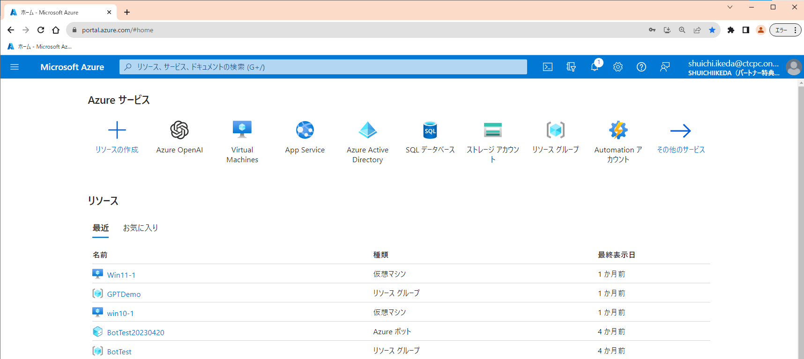

1. リソースの作成からAzure Open AIを選択します。
    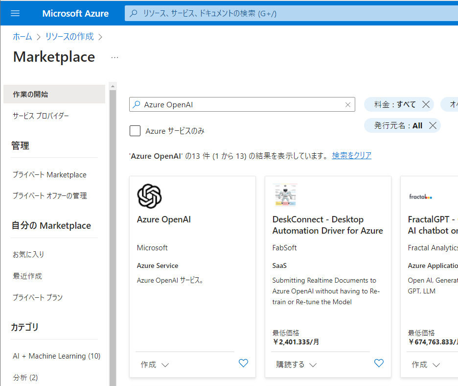

1. Azure OpenAIを作成します。
    

1. Azure OpenAIサービスへのアクセス要求を出します。
    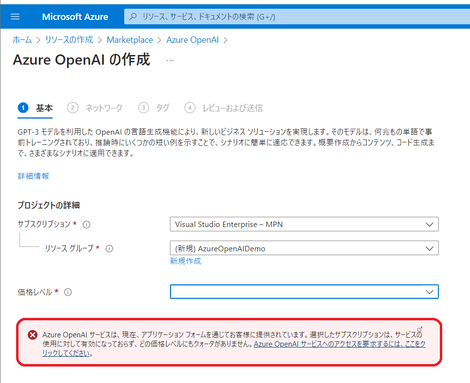

1. Request Access to Azure OpenAI Serviceにアクセスします。
    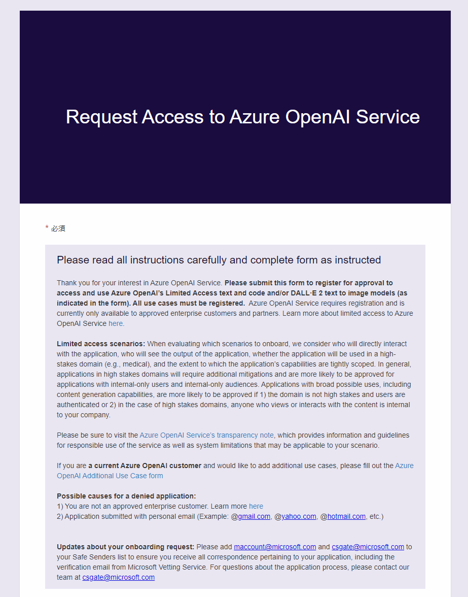

1. Request Access to Azure OpenAI Serviceにアクセスします。
    

1. Your First Name、Your Last Name、How many Azure Subscription ID's would you like to have access to this service?を入力します。
    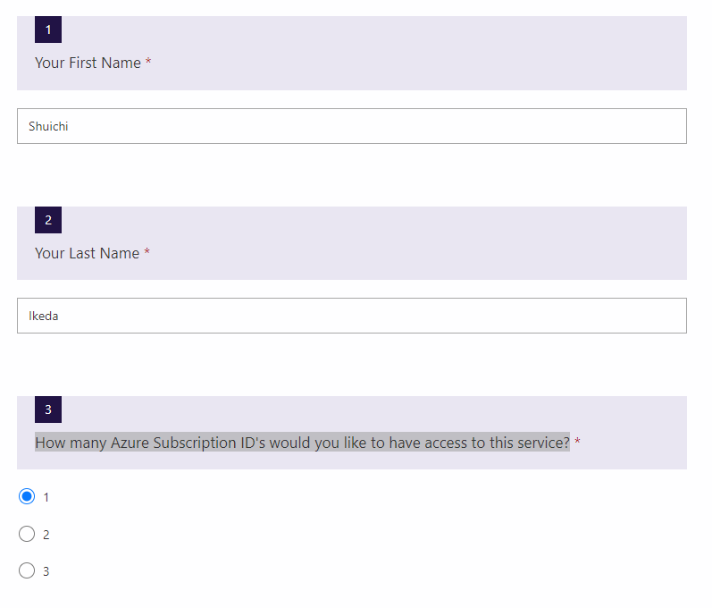

1. Azure Subscription IDを確認します。
    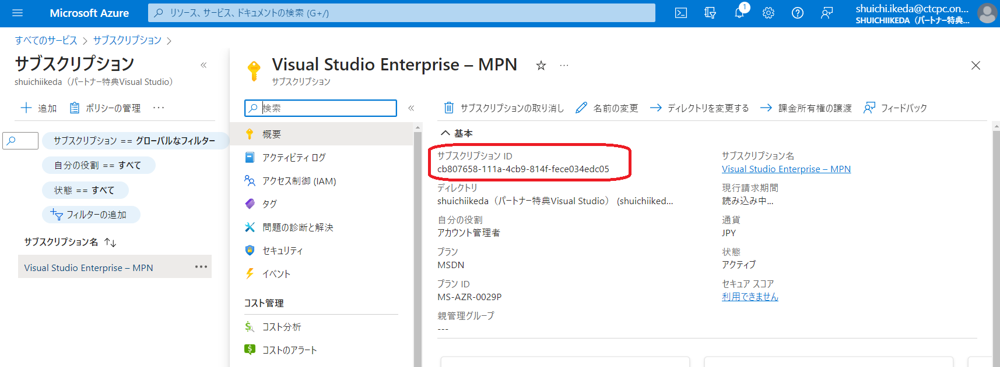

1. Azure Subscription IDを確認します。
    

1. Azure Subscription IDを入力します。
    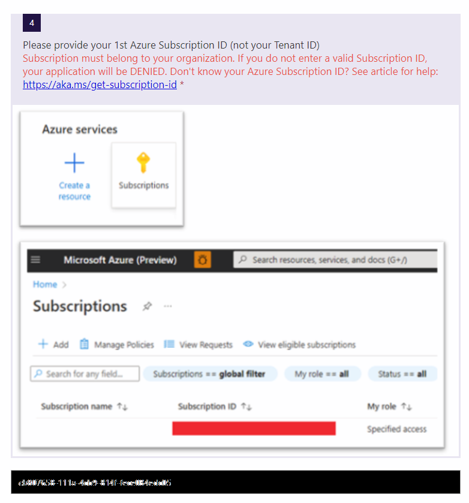

1. 電子メール、会社名、会社住所等を入力します。

1. 下記の質問に回答します。
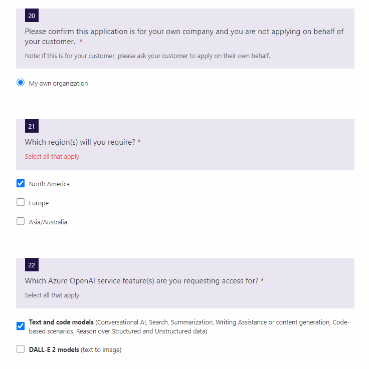

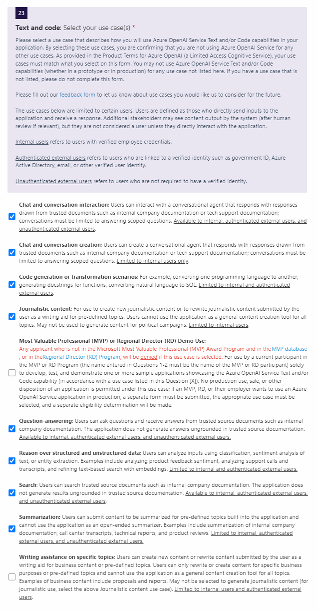
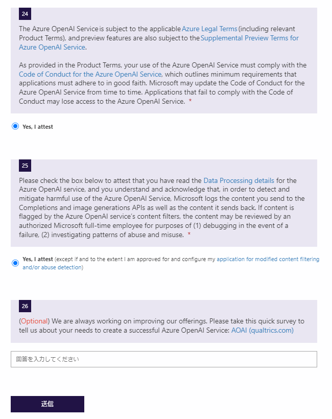

1. 以上となります。
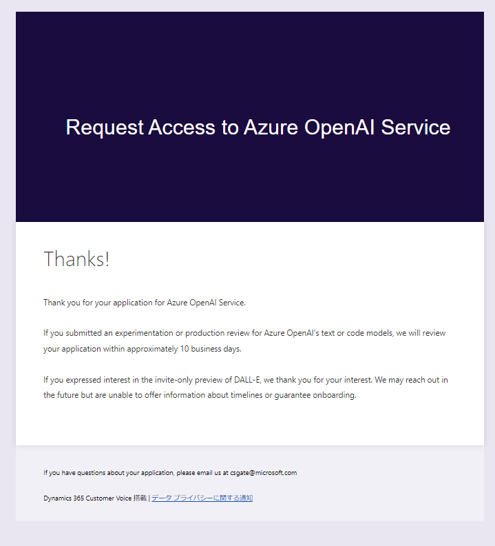
以上