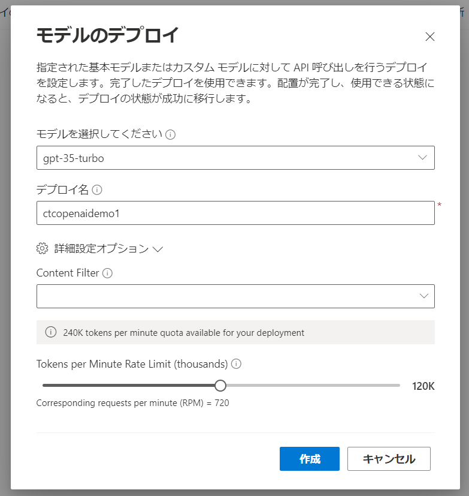

## Azure Open AIの利用方法

### Azure PortalでのAzure Open AIの作成
1. Azure Portalにアクセスします。
    https://portal.azure.com/
    

1. リソースの作成からAzure Open AIを選択します。
    

1. Azure OpenAIを作成します。
    

1. Azure OpenAIサービスへのアクセス要求を出します。
    

1. Request Access to Azure OpenAI Serviceにアクセスします。
    

1. Your First Name、Your Last Name、How many Azure Subscription ID's would you like to have access to this service?を入力します。
    

1. Azure Subscription IDを入力します。
    

1. 電子メール、会社名、会社住所等を入力します。

1. 下記の質問に回答します。
    
    
    
    

1. 以下の画面が表示されたら申請完了です。
    

1. 翌日、下記のメールが届きます。
    

1. 価格レベルで、Standard SOが選択できます。
    

1. ネットワークは、「インターネットを含むすべてのネットワークのリソースにアクセスできます。」を選択します。
    

1. 下図の画面で「作成」ボタンを押下します。
    

1. 下図の画面で「デプロイが完了しました」と表示されます。
    

1. Azure Open AIが利用可能になります。
    

### Lang Chainへの組み込み
1. 下の画面によりキーを確認できます。
    

1. 下記によりLangChainに設定ができます。

    ```
    # Set this to `azure`
    export OPENAI_API_TYPE=azure
    # The API version you want to use: set this to `2023-05-15` for the released version.
    export OPENAI_API_VERSION=2023-05-15
    # The base URL for your Azure OpenAI resource.  You can find this in the Azure portal under your Azure OpenAI resource.
    export OPENAI_API_BASE=https://ctcopenaidemo1.openai.azure.com/
    # The API key for your Azure OpenAI resource.  You can find this in the Azure portal under your Azure OpenAI resource.
    export OPENAI_API_KEY=XXXXXXXXXXXXXX
    ```

    【参考】
    https://python.langchain.com/docs/integrations/llms/azure_openai_example

1. Azure OpenAI Studioに移動します。
    

1. 管理の「デプロイ」で「新しいデプロイの作成」をクリックします。
    

1. モデルを選択し、デプロイ名を入力し、「作成」ボタンを押下します。
    

1. モデルが作成されます。
    

1. Azure Portalから課金情報も見えるようになります。
    

以上