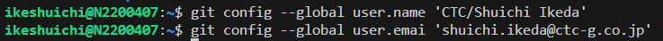
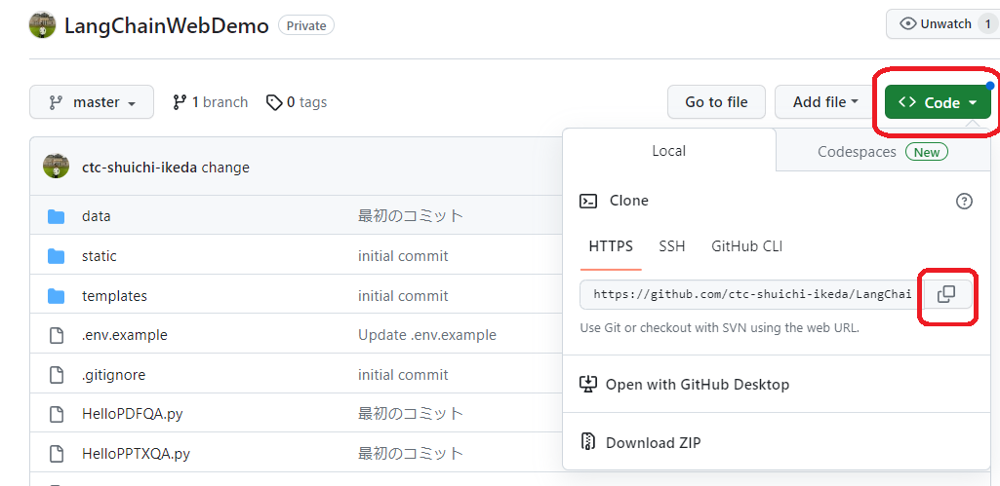
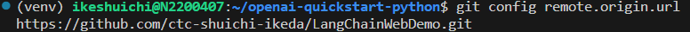
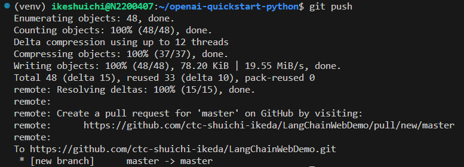

## Gitの利用方法

### GitHubへのアカウント作成
1. GitHubのWebサイトにアクセスします。
    https://github.co.jp/
    

1. GitHubのアカウント、電子メールアドレス、パスワードを設定します。
    

1. GitHubから下図のようなメールが届きます。GitHubを開きます。
    

1. GitHubのプロファイルを適宜編集します。
    

1. Gitコマンドユーザー名と電子メールを設定します。
    ```
    git config --global user.name 'CTC/Shuichi Ikeda'
    git config --global user.emai 'shuichi.ikeda@ctc-g.co.jp'
    ```
    

## 新しいリポジトリの作成

1. GitHubで新しいリポジトリを作成します。
    

1. リポジトリ名、詳細、Privateを選択します。
※ Publicを選択するとインターネットに公開されますのでご注意ください。
    

1. こちらの画面が表示されればリポジトリの追加は成功です。
    

1. GitリポジトリのURLをコピーします。
    
    もし上記の画面が表示されなくなった場合は、下記の画面からもURLがコピーできます。
    

1. VSCodeでリポジトリにPUSHしたいフォルダを開きます。
    

1. Gitコマンドで、現在のリモートのURLを確認します。
    ```
    git config remote.origin.url
    ```
    

1. Gitコマンドで、コピーしたURLに変更します。
    ```
    git remote set-url origin "コピーしたURL"
    ```
    

1. Gitコマンドで、変更後のリモートのURLを確認します。
    ```
    git config remote.origin.url
    ```
    

1. Gitコマンドで、ソースコードをPushします。
    ```
    git push
    ```
    

1. GitHubのリポジトリにソースコードがPushされていることを確認します。
    

1. その後ファイルを編集した際は、VSCodeのソース管理からもコミットできます。

    

1. VSCodeで変更を同期します。

    

1. GitHubのリポジトリにソースコードが変更されていることを確認します。
    


