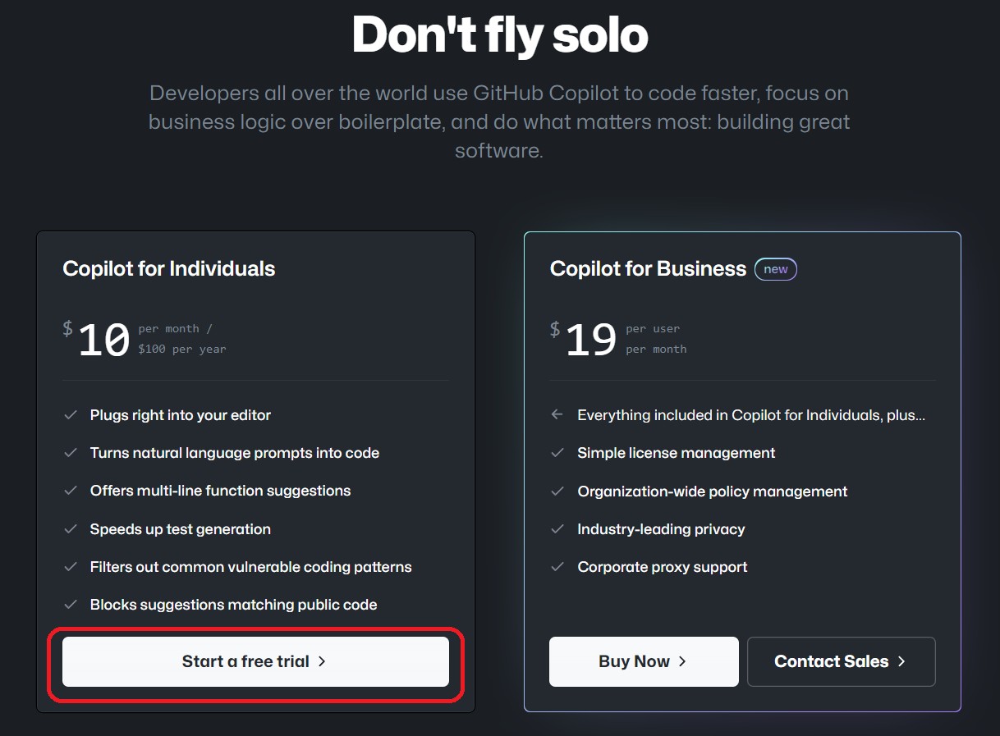
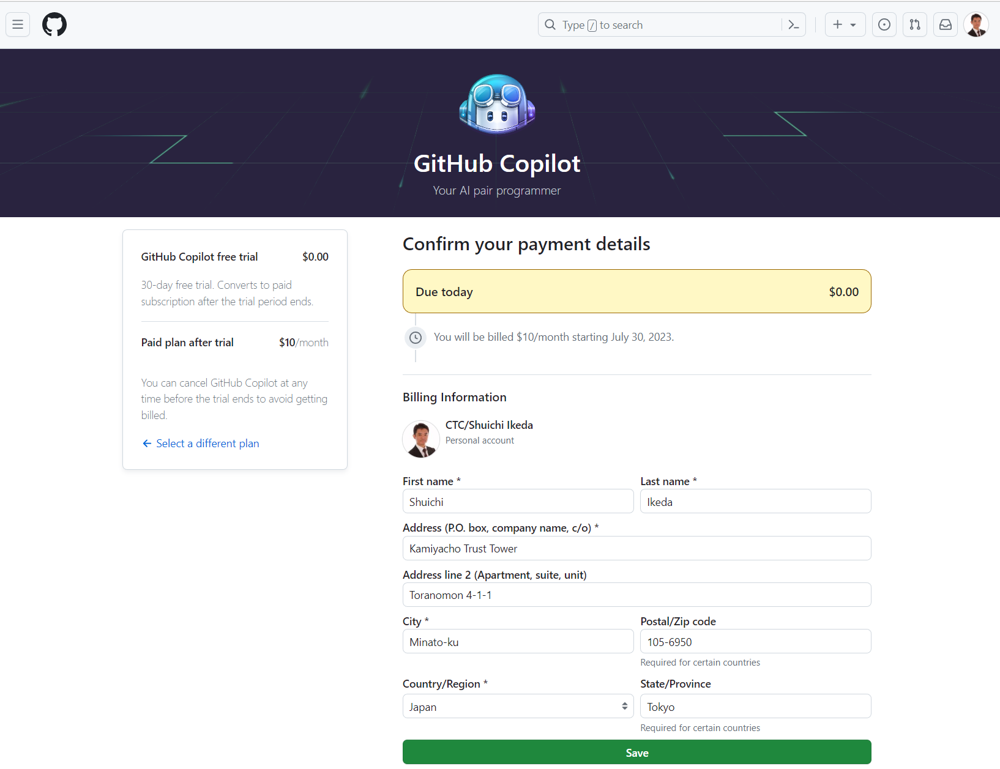
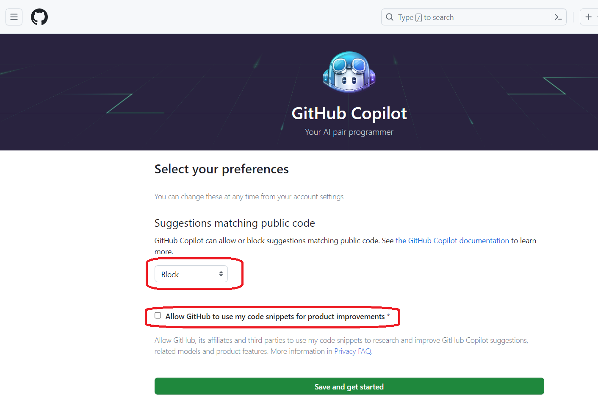
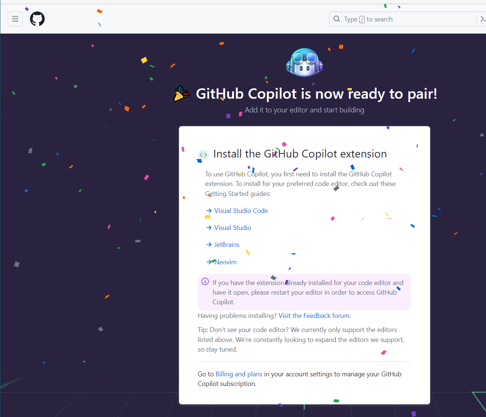
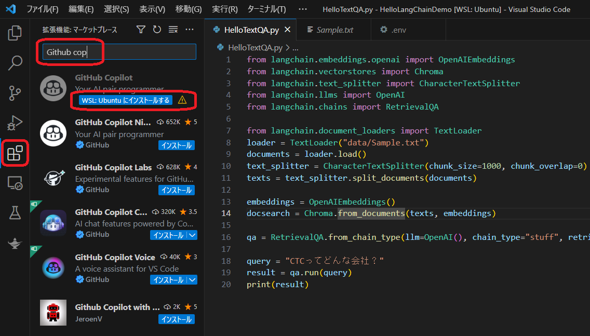
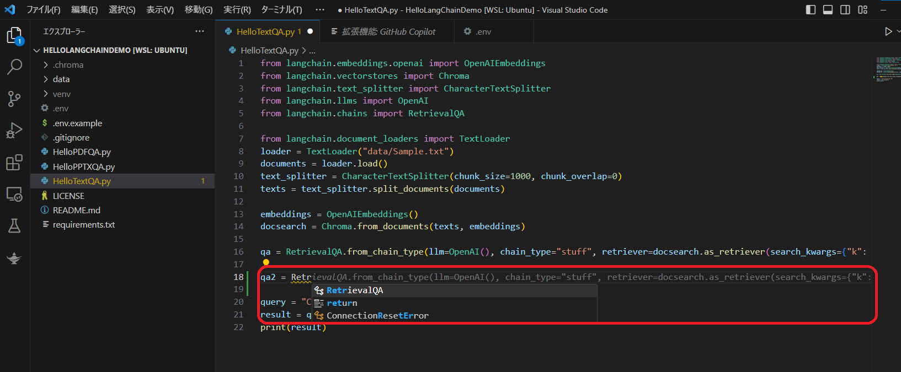

# GitHub Copilotのインストール

## GitHub Copilotとは
GitHub Copilotは、GitHubとOpenAIが共同で開発したAI駆動のコード補完ツールです。このツールは、開発者がコードを書く際に、自動的にコードの推奨や補完を副操縦士（copilot）のように提案することで、コーディングの効率性と速度を向上させることを目的としています。

Copilot for Individualsは月額10$で、1か月間のフリートライアルもあります。

## GitHub Copilotのインストール
1. 下記のURLから、GitHub Copilotを有効化します。
    https://github.com/features/copilot#pricing
    

1. 
    クレジットカード番号を入力します。フリートライアルの場合でも入力が必要です。フリートライアルだけの場合は、1か月以内に退会をしてください。
    
    

1. 学習に利用されないように設定します。
    

1. セットアップが完了です。
    

1. Visual Studio Codeの拡張機能でGitHub Copilotを追加します。

1. コードを入力すること自動的にコードの推奨や補完がされます。

参考:
https://docs.github.com/ja/copilot/getting-started-with-github-copilot