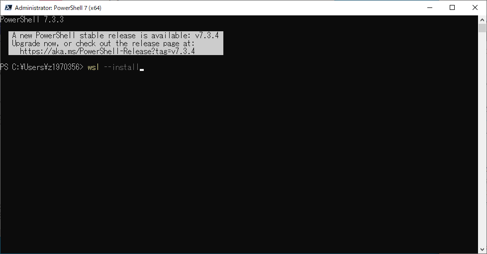

# LangChainの開発環境構築手順
CTCのセキュアPCにLangChainの開発環境を構築する手順を下記に示します。

## Windows subsystem for linux2のインストール

1. PowerShellを管理者権限で開きます。


1. WSLを有効化するために、以下のコマンドを実行します。
    ```
    wsl --install
    ```
    

1. Ubuntuを初期化します。スタートメニューからUbuntuを起動します。
    

1. 初期バスワードを登録します。
    

1. Windowsの左下の検索から「機能の有効化」を検索します。
    

1. 「Hyper-V」と「Linux用Windowsサブシステム」を有効化されていることを確認します。有効化されていない場合は、チェックを入れて有効化してください。

    

1. インストールされているLinuxディストリビューションを確認します。
    ```
    wsl -l -v
    ```
    

参考：
https://learn.microsoft.com/ja-jp/windows/wsl/install


## Visual Studio Code最新版のインストール
1. Visual Studio Codeを下記からダウンロードします。
    https://azure.microsoft.com/ja-jp/products/visual-studio-code
    

1. WSLに接続します。
    

1. Ctrl+Shift+@でターミナルを起動します。
    


## Python 3.10のインストール
1. aptパッケージを更新します。
    ```
    sudo apt update
    ```

1. pipをインストールします。
    ```
    sudo apt install -y python3-pip
    pip3 -V
    ```

1. リポジトリを追加します。
    ```
    sudo apt install -y software-properties-common
    sudo add-apt-repository ppa:deadsnakes/ppa
    ```

1. Python3.10をインストールします。venvで仮想環境を分けるため、python.3.10もインストールしています。
    ```
    sudo apt install -y python3.10 python3.10-venv
    ```

1. pythonのバージョンを確認します。
    ```
    python3 --version
    ```

## git for windows最新版のインストール
1. git for windowsを下記からダウンロードします。
    https://gitforwindows.org/

1. git for windowsのインストーラを起動します。

    

1. Gitリポジトリをクローンします。
    ```
    git clone https://github.com/ctc-shuichi-ikeda/HelloLangChain.git
    ```
    

1. クローンしたGitリポジトリのフォルダをVSCodeで開きます。
    ```
    cd HelloLangChain
    code -r .
    ```
    

## LangChain最新版
1. Pythonの仮想環境を作成し、有効化します。
    ```
    python3 -m venv venv
    . venv/bin/activate
    ```
    
    
1. LangChainに必要なライブラリをインストールします。
    ```
    pip3 install -r requirements.txt
    ```
    

参考：https://github.com/hwchase17/langchain

## ベクトルDB最新版
1. LangChainに必要なベクトルデータベースであるChromaDBをインストールします。
    ```
    pip3 install chromadb
    ```
    

1. OpenAIのトーカナイザーtitokenをインストールします。
    ```
    pip3 install tiktoken
    ```
    

## ChatGPT有償版
1. ChatGPTの有償版のAPI keysのページにアクセスし、「
Create new secret key」を押下します。
https://platform.openai.com/account/api-keys
    

1. Create new secret keyに名前を付与します。
    

1. new secret keyをコピーします。
    

1. ソースコードのos.environ['OPENAI_API_KEY']に値をセットします。
    


## 動作確認
