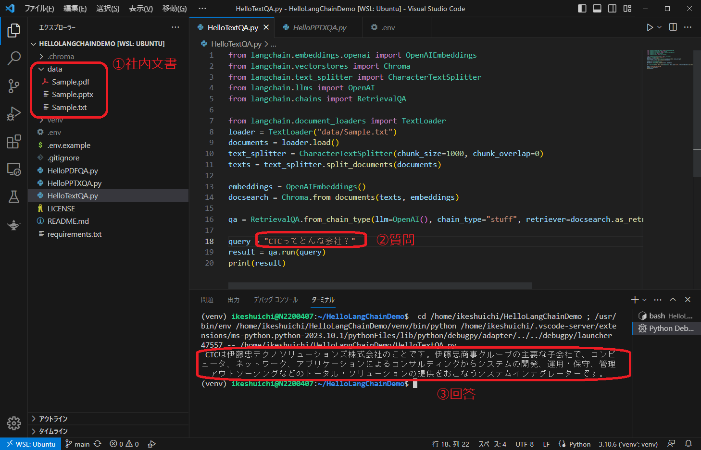
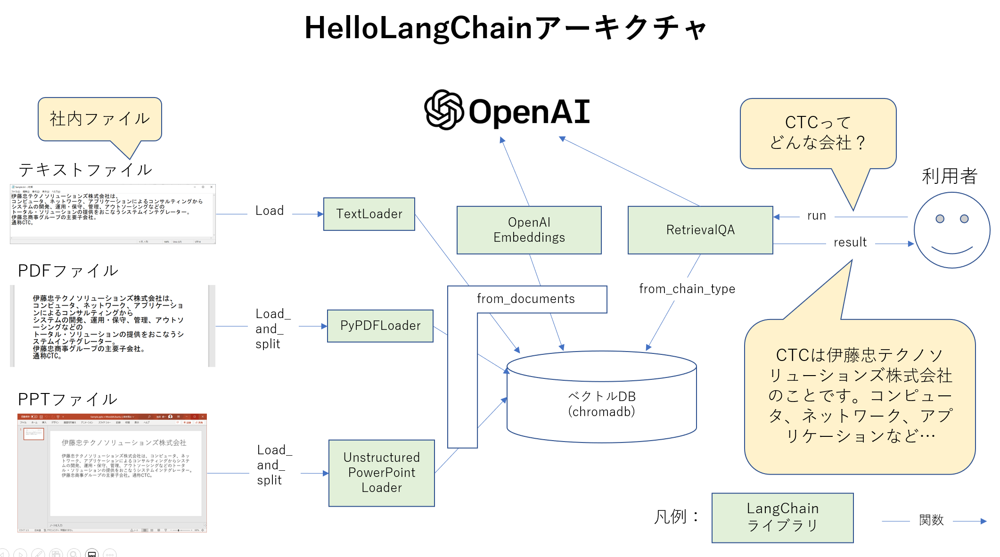
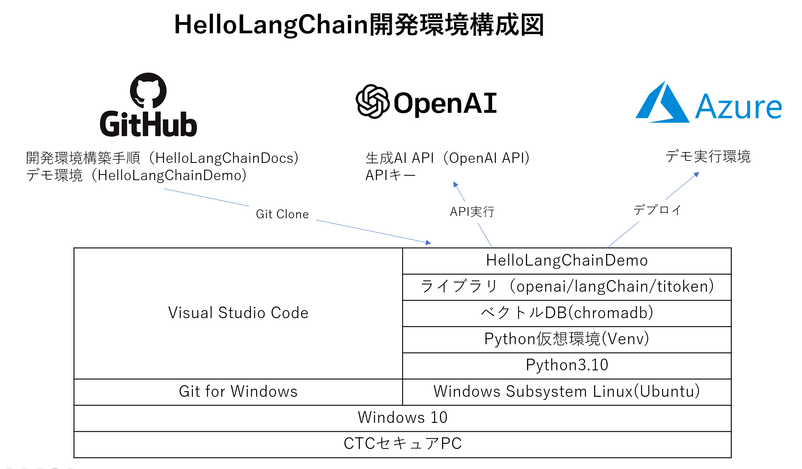

# LangChainのデモ環境

## デモの概要
テキスト、PDF、PPT等の社内ファイルを学習させて、質問に答えるシナリオとなります。
Visual Studio Code上でデモを実行します。

## デモのアーキテクチャ
デモのアーキクチャを下図に示します。社内ファイルは各種Loaderにより読み込まれOpenAI Embeddingsで文書をベクトルに変換し、ベクトルDBであるChromadbに格納されます。
利用者からの質問に対して、RetrievalQAがベクトルDBにある情報の検索し、その結果をOpen AIに渡します。Open AIは文書を生成し、利用者に回答します。
ただし、これは現時点での想定であり、これから実際の動作を確認していきます。

## 開発環境構成図
CTCのセキュアPCにLangChainの開発環境を構築します。
LangChainはPythonライブラリと提供されています。公開情報の手順がLinux環境を前提しているため、Windows上にLinux環境を準備しています。Visual Studio Codeにより、Windows上からシームレスにLinuxを操作することできます。Azureデモ実行環境についてはこれからデプロイ手順を調査・確立していきます。

## 開発環境構築手順
構築手順は[こちら](INSTALL/INSTALL.md)です。

## 開発環境を更に便利に
1. GitHub Copilotの構築手順は[こちら](INSTALL/GitHubCopilot/GitHubCopilotINSTALL.md)です。

## 参考
Open AI Quickstart:
https://platform.openai.com/docs/quickstart

LangChain Github:
https://github.com/hwchase17/langchain

LangChain Getting Started:
https://python.langchain.com/en/latest/getting_started/getting_started.html
