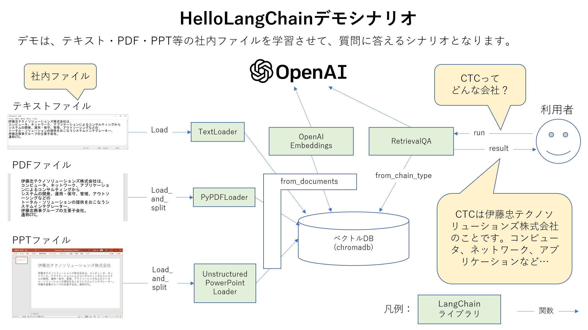

# LangChainのデモ環境

## デモの概要
テキスト、PDF、PPT等の社内ファイルを学習させて、質問に答えるシナリオとなります。

## デモ画面
Visual Studio Code上でデモを実行します。

## 開発環境構成図
CTCのセキュアPCにLangChainの開発環境を構築します。

## 開発環境構築手順
構築手順は[こちら](INSTALL/INSTALL.md)です。

## 参考
Open AI Quickstart:
https://platform.openai.com/docs/quickstart

LangChain Github:
https://github.com/hwchase17/langchain

LangChain Getting Started:
https://python.langchain.com/en/latest/getting_started/getting_started.html
